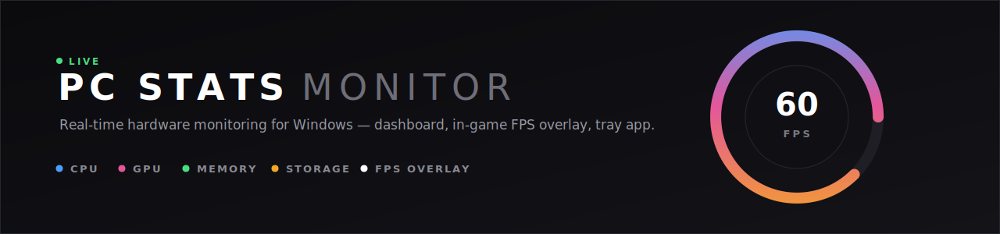
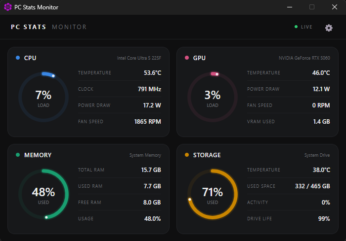
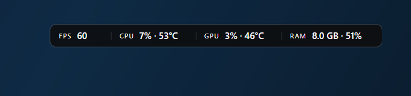

<p align="center">
  
</p>

Real-time hardware monitoring for Windows, built with [Avalonia UI](https://avaloniaui.net/).
A circular-gauge dashboard, a click-through in-game overlay with live FPS, and a tray app —
all in one lightweight package.

## Features

**Dashboard**
- CPU, GPU, RAM and storage stats on animated circular gauges (critically-damped spring animation)
- Temperature, load, clock speed, power draw and fan speed where the hardware exposes them
- Adaptive polling: fast metrics every second, slow ones less often; polling pauses entirely
  while the window is hidden
- Potato mode for minimal resource usage

**In-game overlay (HUD)**
- Live FPS of the foreground game, captured via ETW frame-present tracing
  (the [PresentMon](https://github.com/GameTechDev/PresentMon) technique) — no DLL injection,
  works with borderless and exclusive-fullscreen titles, and with DirectX 9/10/11/12,
  Vulkan and OpenGL
- CPU / GPU load and temperature, RAM, disk — each toggleable
- Click-through, always-on-top, never steals focus, hidden from Alt-Tab
- Position (6 anchors + pixel offsets), size, font, opacity, background and corner style
  are all configurable live

**App**
- Runs in the system tray; closing the window hides it, only tray "Exit" quits
- Single-instance: launching again just brings the running instance forward
- UAC-free autostart via a pre-authorized scheduled task (created by the installer)

## Screenshots

**Dashboard**



**In-game overlay** — live FPS via ETW, click-through, always on top



## Requirements

- Windows 10/11 x64
- **Administrator** — ring0 sensor access (LibreHardwareMonitor), NVML and the real-time
  ETW session for FPS capture all require elevation. The app manifest requests it once;
  installed launches go through a scheduled task so there is no UAC prompt after install.
- **[PawnIO](https://pawnio.eu/)** driver for CPU temperature/clock/power sensors.
  Microsoft revoked WinRing0's signing certificate in 2024, so LibreHardwareMonitor can no
  longer load its own driver — PawnIO is the signed, HVCI-compatible replacement.
  The installer bundles and installs it silently.

## Install

Grab `PCStatsMonitor-Setup-<version>.exe` from
[Releases](https://github.com/RevvLabs/PCStatsMonitor/releases) and run it. It installs
per-machine, sets up PawnIO, and registers the UAC-free launcher task.

Releases are built automatically by GitHub Actions on every push to `main`
(see `.github/workflows/release.yml`).

## Build from source

Requires the [.NET 10 SDK](https://dotnet.microsoft.com/download).

```powershell
git clone https://github.com/RevvLabs/PCStatsMonitor.git
cd PCStatsMonitor
dotnet build PCStatsMonitor.sln
```

Or just run `build_and_run.bat` (Windows) / `build_and_run.sh` (Linux).

> **Note:** `dotnet run` bypasses the app manifest (the host is dotnet.exe), so sensors read
> N/A without elevation. For a real test, build and launch the produced exe.

To produce the installer (requires [Inno Setup 6](https://jrsoftware.org/isinfo.php)):

```powershell
dotnet publish src/PCStatsMonitor.App/PCStatsMonitor.App.csproj -c Release -f net10.0-windows -r win-x64 -o publish/win-x64
iscc installer/PCStatsMonitor.iss
# → dist/PCStatsMonitor-Setup-<version>.exe
```

## Project layout

| Path | What it is |
|---|---|
| `src/PCStatsMonitor.App` | Avalonia UI: dashboard, overlay window, tray, settings |
| `src/PCStatsMonitor.Core` | Sensor pump, metric model, polling cadence, provider interface |
| `src/PCStatsMonitor.Providers.Windows` | Windows providers: PDH, WMI, EMI, NVMe, memory, FPS (ETW) |
| `src/PCStatsMonitor.Providers.Lhm` | LibreHardwareMonitor provider (CPU/GPU/fan sensors) |
| `src/PCStatsMonitor.Providers.Linux` | Linux providers (hwmon subset) |
| `tests/` | Unit tests for Core and the LHM provider |
| `installer/` | Inno Setup script + bundled PawnIO redistributable |
| `LhmDump/` | Dev utility: dumps every sensor LibreHardwareMonitor sees on this machine |

### How the FPS overlay works

A real-time ETW session subscribes to the `Microsoft-Windows-DXGI`, `Microsoft-Windows-D3D9`
and `Microsoft-Windows-DxgKrnl` providers and counts frame-present events
(`Present::Start`, and kernel `Present/Flip/Blit` for APIs that bypass DXGI) for the process
that owns the foreground window. Counts are windowed over one second using event-header
timestamps. Kernel-only sources below 20 fps are treated as desktop-app noise and ignored.
See `src/PCStatsMonitor.Providers.Windows/FpsMonitor.cs`.

## Credits

- [LibreHardwareMonitor](https://github.com/LibreHardwareMonitor/LibreHardwareMonitor) (MPL-2.0) — hardware sensor backend
- [PawnIO](https://pawnio.eu/) — signed kernel driver for MSR/SuperIO access
- [Intel PresentMon](https://github.com/GameTechDev/PresentMon) — the ETW frame-present technique the FPS capture is based on
- [Microsoft.Diagnostics.Tracing.TraceEvent](https://github.com/microsoft/perfview) — managed ETW consumption
- [Avalonia UI](https://avaloniaui.net/) — cross-platform .NET UI framework

## License

[MIT](LICENSE)
